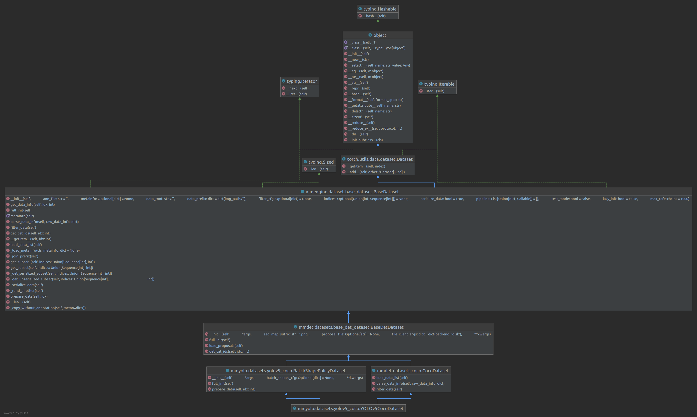
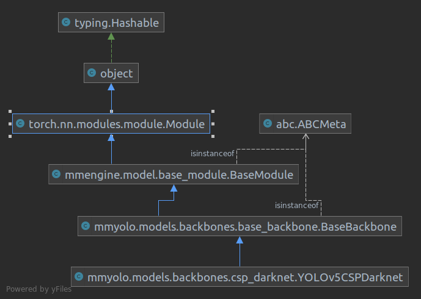
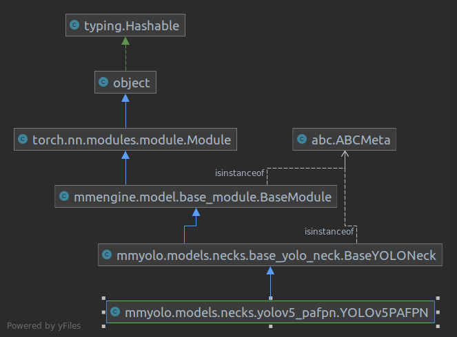
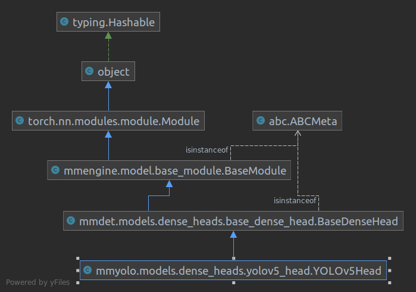

# learn_mmyolo
[mmengine](https://github.com/open-mmlab/mmengine)
[mmyolo](https://github.com/open-mmlab/mmyolo)
个人学习笔记，瞎写


# 1 Open-MMlab仓库简介

## 1.1 MMlab 2.0架构
底层深度学习框架为PyTorch, 基础库为MMCV和MMEngine，再往上是针对不同CV任务的库 (如MMYOLO)，最上层是部署用的库MMDeploy。
<div style="text-align: center;"></div>

## 1.2 MMEngine模块组成
主要模块：数据集、模型、评测、参数调度、优化器等，由执行器统一管理。 <br />
其他特色：日志、可视化、注册器、配置文件等
<div style="text-align: center;"></div>

## 1.3 MMYOLO模型结构
YOLO系列算法抽象化，Backbone + Neck + Head
<div style="text-align: center;"></div>


# 2 安装

## 2.1 安装显卡驱动
如无特殊需求直接安装最新NVIDIA GPU驱动。
```bash
// 直接安装最新驱动
$ sudo ubuntu-drivers autoinstall
...
// 验证
$ nvidia-smi
/* 输出
Fri Dec 16 16:54:15 2022       
+-----------------------------------------------------------------------------+
| NVIDIA-SMI 510.108.03   Driver Version: 510.108.03   CUDA Version: 11.6     |
|-------------------------------+----------------------+----------------------+
| GPU  Name        Persistence-M| Bus-Id        Disp.A | Volatile Uncorr. ECC |
| Fan  Temp  Perf  Pwr:Usage/Cap|         Memory-Usage | GPU-Util  Compute M. |
|                               |                      |               MIG M. |
|===============================+======================+======================|
|   0  NVIDIA GeForce ...  Off  | 00000000:01:00.0  On |                  N/A |
| N/A   52C    P8    11W /  N/A |    518MiB /  6144MiB |      2%      Default |
|                               |                      |                  N/A |
+-------------------------------+----------------------+----------------------+
                                                                               
+-----------------------------------------------------------------------------+
| Processes:                                                                  |
|  GPU   GI   CI        PID   Type   Process name                  GPU Memory |
|        ID   ID                                                   Usage      |
|=============================================================================|
|    0   N/A  N/A      1247      G   /usr/lib/xorg/Xorg                 45MiB |
|    0   N/A  N/A      2178      G   /usr/lib/xorg/Xorg                223MiB |
|    0   N/A  N/A      2366      G   /usr/bin/gnome-shell               36MiB |
|    0   N/A  N/A      4255      G   ...Tencent\WeChat\WeChat.exe       25MiB |
|    0   N/A  N/A      4485      G   ...cent\WeChat\WeChatApp.exe       16MiB |
|    0   N/A  N/A      4701      G   /usr/lib/firefox/firefox          136MiB |
|    0   N/A  N/A     53929      G   ..._52429.log --shared-files       18MiB |
+-----------------------------------------------------------------------------+
*/
```
输出中的"CUDA Version: 11.6"为`CUDA DRIVER`版本，与我们开发用的`CUDA RUNTIME`版本 (nvcc --version 的输出) 不是一个概念，
通常`CUDA DRIVER`版本能向下兼容`CUDA RUNTIME`。
安装完毕后可在主机环境下安装或使用Docker镜像 (二选一)。

## 2.2a 主机环境下安装

### (1) 安装CUDA Toolkits
* [CUDA](https://docs.nvidia.com/cuda/cuda-installation-guide-linux/index.html)
* [CUDNN](https://docs.nvidia.com/deeplearning/cudnn/install-guide/index.html)
* [TensorRT](https://docs.nvidia.com/deeplearning/tensorrt/install-guide/index.html)

### (2) 通过Conda安装MMYOLO
```bash
// 安装conda, https://mirrors.tuna.tsinghua.edu.cn/help/anaconda/
// ...
// 创建conda环境
$ conda create -n open-mmlab python=3.8 -y
$ conda activate open-mmlab

// 安装PyTorch 1.6+, https://pytorch.org/
// ...
// 验证
$ python -c 'import torch;print(torch.__version__);print(torch.cuda.is_available())'

// 安装mmengine, mmcv, mmdet, mmyolo
$ pip install -U openmim
$ mim install "mmengine>=0.3.1"
$ mim install "mmcv>=2.0.0rc1,<2.1.0"
$ mim install "mmdet>=3.0.0rc3,<3.1.0"

// 三方库方式安装
$ mim install "mmyolo"

// 或按 源码+可编辑模式 安装
$ git clone https://github.com/open-mmlab/mmengine.git
$ cd mmengine
$ pip install -e . -v
```

## 2.2b 使用Docker镜像
安装[nvidia-docker](https://github.com/NVIDIA/nvidia-docker)
```bash
// 使用Dockerfile构建镜像
$ docker/build_image.bash

// 或直接拉取构建好的镜像
$ docker pull stliu2022/mmyolo:master

// 创建容器并进入
$ docker/create_container.bash
root@xxx:/opt/project# ... 
```


# 3 MMEngine介绍

## 3.1 上手级

### (1) 构建模型
```python
import torch
from typing import Optional, Union, Dict
from mmengine.model import BaseModel


# 继承BaseModel，实现forward()方法
class ToyModel(BaseModel):
    def __init__(self):
        super().__init__()
        ...
        
    def forward(self,
                inputs: torch.Tensor,
                data_samples: Optional[list] = None,
                mode: str = 'tensor') -> Union[Dict[str, torch.Tensor], list]:
        ...
```

### (2) 构建数据集和数据加载器
```python
import os.path as osp
from typing import List

from torch.utils.data import DataLoader

from mmengine.dataset import BaseDataset
from mmcv.transforms import LoadImageFromFile, LoadAnnotations


class ToyDataset(BaseDataset):    
    # 重载parse_data_info()来加载标签
    def parse_data_info(self, raw_data_info):
        data_info = raw_data_info
        img_prefix = self.data_prefix.get('img_path', None)
        if img_prefix is not None:
            data_info['img_path'] = osp.join(
                img_prefix, data_info['img_path'])
        return data_info

train_dataset = ToyDataset(
    data_root='data/',
    data_prefix=dict(img_path='train/'),
    ann_file='annotations/train.json',
    pipeline=[LoadImageFromFile,
              LoadAnnotations]
)

# 直接使用pytorch DataLoader类
train_dataloader = DataLoader(
    batch_size=32,
    shuffle=False,
    dataset=train_dataset
)
```

### (3) 构建评测指标
```python
from typing import Any, Sequence

from mmengine.evaluator import BaseMetric


class ToyMetric(BaseMetric):
    # 单批次处理结果存入中间结果中
    def process(self, data_batch: Any, data_samples: Sequence[dict]) -> None:
        # ...
        # self.results.append(...)
        pass
    
    # 计算度量指标
    def compute_metrics(self, results: list) -> dict:
        # ...
        return dict(accuracy=1.0)
```

### (4) 构建执行器，开始训练
```python
from torch.optim import SGD
from mmengine.runner import Runner

runner = Runner(
    model=ToyModel(),
    work_dir='./work_dir',
    train_dataloader=train_dataloader,
    optim_wrapper=dict(optimizer=dict(type=SGD, lr=0.001, momentum=0.9)),
    train_cfg=dict(by_epoch=True, max_epoch=5, val_interval=1),
    val_dataloader=train_dataloader,
    val_cfg=dict(),
    val_evaluator=dict(type=Accuracy),
)

runner.train()
```

输出训练日志
```bash
2022/08/22 15:51:53 - mmengine - INFO -
------------------------------------------------------------
System environment:
    sys.platform: linux
    Python: 3.8.12 (default, Oct 12 2021, 13:49:34) [GCC 7.5.0]
    CUDA available: True
    numpy_random_seed: 1513128759
    GPU 0: NVIDIA GeForce GTX 1660 SUPER
    CUDA_HOME: /usr/local/cuda
...

2022/08/22 15:51:54 - mmengine - INFO - Checkpoints will be saved to /home/mazerun/work_dir by HardDiskBackend.
2022/08/22 15:51:56 - mmengine - INFO - Epoch(train) [1][10/1563]  lr: 1.0000e-03  eta: 0:18:23  time: 0.1414  data_time: 0.0077  memory: 392  loss: 5.3465
2022/08/22 15:51:56 - mmengine - INFO - Epoch(train) [1][20/1563]  lr: 1.0000e-03  eta: 0:11:29  time: 0.0354  data_time: 0.0077  memory: 392  loss: 2.7734
2022/08/22 15:51:56 - mmengine - INFO - Epoch(train) [1][30/1563]  lr: 1.0000e-03  eta: 0:09:10  time: 0.0352  data_time: 0.0076  memory: 392  loss: 2.7789
2022/08/22 15:51:57 - mmengine - INFO - Epoch(train) [1][40/1563]  lr: 1.0000e-03  eta: 0:08:00  time: 0.0353  data_time: 0.0073  memory: 392  loss: 2.5725
2022/08/22 15:51:57 - mmengine - INFO - Epoch(train) [1][50/1563]  lr: 1.0000e-03  eta: 0:07:17  time: 0.0347  data_time: 0.0073  memory: 392  loss: 2.7382
2022/08/22 15:51:57 - mmengine - INFO - Epoch(train) [1][60/1563]  lr: 1.0000e-03  eta: 0:06:49  time: 0.0347  data_time: 0.0072  memory: 392  loss: 2.5956
2022/08/22 15:51:58 - mmengine - INFO - Epoch(train) [1][70/1563]  lr: 1.0000e-03  eta: 0:06:28  time: 0.0348  data_time: 0.0072  memory: 392  loss: 2.7351
...
2022/08/22 15:52:50 - mmengine - INFO - Saving checkpoint at 1 epochs
2022/08/22 15:52:51 - mmengine - INFO - Epoch(val) [1][10/313]    eta: 0:00:03  time: 0.0122  data_time: 0.0047  memory: 392
2022/08/22 15:52:51 - mmengine - INFO - Epoch(val) [1][20/313]    eta: 0:00:03  time: 0.0122  data_time: 0.0047  memory: 308
2022/08/22 15:52:51 - mmengine - INFO - Epoch(val) [1][30/313]    eta: 0:00:03  time: 0.0123  data_time: 0.0047  memory: 308
...
2022/08/22 15:52:54 - mmengine - INFO - Epoch(val) [1][313/313]  accuracy: 35.7000
```

## 3.2 注册器机制
注册器 (Registry) 可以看作是一个映射表和模块构建方法的组合。(类似工厂模式?)

入门用法:
```python
import torch.nn as nn

from mmengine import Registry

ACTIVATION = Registry('activation', scope='mmengine')


# 以装饰器方式管理模块，模块在被import时自动注册
@ACTIVATION.register_module()
class Sigmoid(nn.Module):
    def __init__(self):
        super().__init__()

    def forward(self, x):
        print('call Sigmoid.forward')
        return x


@ACTIVATION.register_module()
class ReLU(nn.Module):
    def __init__(self, inplace=False):
        super().__init__()

    def forward(self, x):
        print('call ReLU.forward')
        return x

    
@ACTIVATION.register_module()
class Softmax(nn.Module):
    def __init__(self):
        super().__init__()

    def forward(self, x):
        print('call Softmax.forward')
        return x
```
通过注册建立字符串与函数之间的映射
```python
print(ACTIVATION.module_dict)
# {
#     'Sigmoid': __main__.Sigmoid,
#     'ReLU': __main__.ReLU,
#     'Softmax': __main__.Softmax
# }
```
通过配置文件使用模块
```python
import torch

inputs = torch.randn(2)

act_cfg = dict(type='Sigmoid')
# 传入字典dict(type='类名', kwargs='初始化参数')构建类
# build()方法也可重载
activation = ACTIVATION.build(act_cfg)
outputs = activation(inputs)
# call Sigmoid.forward
print(outputs)

act_cfg = dict(type='ReLU', inplace=True)
activation = ACTIVATION.build(act_cfg)
outputs = activation(inputs)
# call ReLU.forward
print(outputs)
```
`Registry`类支持层级注册等，可调用父节点与兄弟节点中的模块
```python
from mmengine import Registry, MODELS as MMENGINE_MODELS

MODELS = Registry('model', parent=MMENGINE_MODELS, scope='mmalpha')

model = MODELS.build(cfg=dict(type='mmengine.RReLU'))
```

## 3.3 配置类
配置读取类 (Config) 提供了统一接口`Concig.fromfile()`来读取和解析配置文件，支持Python、Json和YAML格式。

`learn_read_config.py`:
```python
test_int = 1
test_list = [1, 2, 3]
test_dict = dict(key1='value1', key2=0.1)
```
```python
from mmengine.config import Config

cfg = Config.fromfile('learn_read_config.py')
print(cfg)
# Config (path: learn_read_config.py): {'test_int': 1, 'test_list': [1, 2, 3], 'test_dict': {'key1': 'value1', 'key2': 0.1}}


print(cfg.test_int)
print(cfg.test_list)
print(cfg.test_dict)
cfg.test_int = 2

print(cfg['test_int'])
print(cfg['test_list'])
print(cfg['test_dict'])
cfg['test_list'][1] = 3
print(cfg['test_list'])
# 1
# [1, 2, 3]
# {'key1': 'value1', 'key2': 0.1}
# 2
# [1, 2, 3]
# {'key1': 'value1', 'key2': 0.1}
# [1, 3, 3]
```

配置文件支持继承等功能：

`optimizer_cfg.py`:
```python
optimizer = dict(type='SGD', lr=0.02, momentum=0.9, weight_decay=0.0001)
```

`resnet50.py`:
```python
_base_ = ['optimizer_cfg.py']
model = dict(type='ResNet', depth=50)
```

```python
cfg = Config.fromfile('resnet50.py')
print(cfg.optimizer)
# {'type': 'SGD', 'lr': 0.02, 'momentum': 0.9, 'weight_decay': 0.0001}
```

## 3.4 MMEngine的实际应用流程

### (1) 编写配置文档
`config.py`
```python
# runtime
default_scope = 'mmdet'
default_hooks = ...
env_cfg = ...
...

# scheduler
train_cfg = ...
val_cfg = ...
test_cfg = ...
param_scheduler = ...
optim_wrapper = ...
...

# dataset
train_dataloader = dict(
    batch_size=2,
    num_workers=2,
    dataset=dict(
        type='CocoDataset',
        data_root='data/coco/',
        ann_file='annotations/instance.json',
        pipeline=[...]
    ),
    ...
)
val_dataloader = ...
test_dataloader = ...
val_evaluator = ...
test_evaluator = ...

# model
model = dict(
    type='ResNet',
    depth=50,
    ...
)
```

### (2) 启动训练或推理脚本
`train.py`
```python
from mmengine.config import Config
from mmengine.registry import RUNNERS
from mmdet.utils import register_all_modules

if __name__ == '__main__':
    register_all_modules()
    cfg = Config.fromfile('path/to/config')
    
    # ...
    runner = RUNNERS.build(cfg)
    
    runner.train()
    # or
    # runner.test()
```
`inference.py`
```python
from mmengine.config import Config
from mmdet.apis import init_detector, inference_detector

if __name__ == '__main__':
    cfg = Config.fromfile('path/to/config')
    model = init_detector(cfg, 'path/to/checkpoint', device="cuda:0")
    result = inference_detector(model, 'path/to/img')
    # pro-process
    # ...
```


# 4 MMYOLO介绍

## 4.1 YOLOV5原理和实现
YOLOV5-P5结构
<div style="text-align: center;"></div>

YOLOV5-P6结构
<div style="text-align: center;"></div>

训练&测试
<div style="text-align: center;"></div>

### (1) 数据集

* 数据集`YOLOv5CocoDataset`
  
UML:


关键源码:
```python
from mmdet.datasets.base_det_dataset import BaseDetDataset


class CocoDataset(BaseDetDataset):
    def load_data_list(self) -> List[dict]:
        ...
        data_list = []
        for img_id in img_ids:
            ...
            parsed_data_info = self.parse_data_info({
                'raw_ann_info': raw_ann_info,
                'raw_img_info': raw_img_info
            })
            data_list.append(parsed_data_info)
        ...
        
        return data_list

    def parse_data_info(self, raw_data_info: dict) -> Union[dict, List[dict]]:
        data_info = {}
        ...
        instances = []
        for i, ann in enumerate(ann_info):
            instance = {}
            ...
            instance['bbox'] = ...
            instance['bbox_label'] = ...
            instance['mask'] = ...
            
            instances.append(instance)
        data_info['instances'] = instances
        return data_info
```

### (2) 数据增强

单图像增强，混合图像增强 (标注也同步变换)

* Mosaic 马赛克
<div style="text-align: center;"></div>  

* RandomAffine 随机仿射变换
<div style="text-align: center;"></div>  

* MixUp
<div style="text-align: center;"></div>  

* 图像模糊等采用 Albu 库实现的变换
* HSV 颜色空间增强
* 随机水平翻转

更多数据增强: mmyolo.datasets.transforms

抽象数据接口: mmengine.BaseDataElement, InstanceData, PixelData, LabelData
<div style="text-align: center;"></div>

下游数据接口: DataSample, DetDataSample, xxxDataSample

### (3) 网络结构

* 骨干网络`YOLOv5CSPDarknet`

UML:



关键源码:
```python
"""
特征金字塔由stem层和多个stage组成

stage4    20x20x1024
stage3    40x40x512
stage2    80x80x256
stage1    160x160x128
stem      320x320x64
image     640x640x3
"""
class BaseBackbone(BaseModule, metaclass=ABCMeta):
    def __init__(self):
        ...
        self.stem = self.build_stem_layer()
        self.layers = ['stem']

        for idx, setting in enumerate(arch_setting):
            stage = []
            stage += self.build_stage_layer(idx, setting)
            ...
            self.add_module(f'stage{idx + 1}', nn.Sequential(*stage))
            self.layers.append(f'stage{idx + 1}')
    
    def forward(self, x: torch.Tensor) -> tuple:
        """Forward batch_inputs from the data_preprocessor."""
        outs = []
        for i, layer_name in enumerate(self.layers):
            layer = getattr(self, layer_name)
            x = layer(x)
            if i in self.out_indices:
                outs.append(x)

        return tuple(outs)
    
    @abstractmethod
    def build_stem_layer(self):
        ...
    
    ...

# stage2-4的输出作为Backbone的输出
class YOLOv5CSPDarknet(BaseBackbone):
    def __init__(self):
        ...

    def build_stem_layer(self) -> nn.Module:
        """Build a stem layer."""
        return ConvModule(
            self.input_channels,
            make_divisible(self.arch_setting[0][0], self.widen_factor),
            kernel_size=6,
            stride=2,
            padding=2,
            norm_cfg=self.norm_cfg,
            act_cfg=self.act_cfg)
    
    def build_stage_layer(self, stage_idx: int, setting: list) -> list:
        """Build a stage layer.

        Args:
            stage_idx (int): The index of a stage layer.
            setting (list): The architecture setting of a stage layer.
        """
        
        in_channels, out_channels, num_blocks, add_identity, use_spp = setting

        in_channels = make_divisible(in_channels, self.widen_factor)
        out_channels = make_divisible(out_channels, self.widen_factor)
        num_blocks = make_round(num_blocks, self.deepen_factor)
        stage = []
        conv_layer = ConvModule(
            in_channels,
            out_channels,
            kernel_size=3,
            stride=2,
            padding=1,
            norm_cfg=self.norm_cfg,
            act_cfg=self.act_cfg)
        stage.append(conv_layer)
        csp_layer = CSPLayer(
            out_channels,
            out_channels,
            num_blocks=num_blocks,
            add_identity=add_identity,
            norm_cfg=self.norm_cfg,
            act_cfg=self.act_cfg)
        stage.append(csp_layer)
        if use_spp:
            spp = SPPFBottleneck(
                out_channels,
                out_channels,
                kernel_sizes=5,
                norm_cfg=self.norm_cfg,
                act_cfg=self.act_cfg)
            stage.append(spp)
        return stage
```

* 颈部网络`YOLOv5PAFPN`

UML:



关键源码:
```python
"""
reduce_layer      仅改变channels
upsample_layer    增加空间size
downsample_layer  减少空间size

backbone_out_1    ->  top_down_1    ->  bottom_up_3   ->  neck_out_1
                            |               ^
                            v               |
backbone_out_2    ->  top_down_2    ->  bottom_up_2   ->  neck_out_2
                            |               ^
                            v               |
backbone_out_3    ->  top_down_3    ->  bottom_up_1   ->  neck_out_3
"""
class BaseYOLONeck(BaseModule, metaclass=ABCMeta):
    def __init__(self, ...):
        ...
        self.reduce_layers = nn.ModuleList()
        for idx in range(len(in_channels)):
            self.reduce_layers.append(self.build_reduce_layer(idx))

        # build top-down blocks
        self.upsample_layers = nn.ModuleList()
        self.top_down_layers = nn.ModuleList()
        for idx in range(len(in_channels) - 1, 0, -1):
            self.upsample_layers.append(self.build_upsample_layer(idx))
            self.top_down_layers.append(self.build_top_down_layer(idx))

        # build bottom-up blocks
        self.downsample_layers = nn.ModuleList()
        self.bottom_up_layers = nn.ModuleList()
        for idx in range(len(in_channels) - 1):
            self.downsample_layers.append(self.build_downsample_layer(idx))
            self.bottom_up_layers.append(self.build_bottom_up_layer(idx))

        self.out_layers = nn.ModuleList()
        for idx in range(len(in_channels)):
            self.out_layers.append(self.build_out_layer(idx))
    
    
    @abstractmethod
    def build_reduce_layer(self, idx: int):
        """build reduce layer."""
        pass

    @abstractmethod
    def build_upsample_layer(self, idx: int):
        """build upsample layer."""
        pass

    ...
    
    def forward(self, inputs: List[torch.Tensor]) -> tuple:
        """Forward function."""
        assert len(inputs) == len(self.in_channels)
        # reduce layers
        reduce_outs = []
        for idx in range(len(self.in_channels)):
            reduce_outs.append(self.reduce_layers[idx](inputs[idx]))

        # top-down path
        inner_outs = [reduce_outs[-1]]
        for idx in range(len(self.in_channels) - 1, 0, -1):
            feat_high = inner_outs[0]
            feat_low = reduce_outs[idx - 1]
            upsample_feat = self.upsample_layers[len(self.in_channels) - 1 -
                                                 idx](
                                                     feat_high)
            if self.upsample_feats_cat_first:
                top_down_layer_inputs = torch.cat([upsample_feat, feat_low], 1)
            else:
                top_down_layer_inputs = torch.cat([feat_low, upsample_feat], 1)
            inner_out = self.top_down_layers[len(self.in_channels) - 1 - idx](
                top_down_layer_inputs)
            inner_outs.insert(0, inner_out)

        # bottom-up path
        outs = [inner_outs[0]]
        for idx in range(len(self.in_channels) - 1):
            feat_low = outs[-1]
            feat_high = inner_outs[idx + 1]
            downsample_feat = self.downsample_layers[idx](feat_low)
            out = self.bottom_up_layers[idx](
                torch.cat([downsample_feat, feat_high], 1))
            outs.append(out)

        # out_layers
        results = []
        for idx in range(len(self.in_channels)):
            results.append(self.out_layers[idx](outs[idx]))

        return tuple(results)


class YOLOv5PAFPN(BaseYOLONeck):
    def build_reduce_layer(self, idx: int) -> nn.Module:
        ...
        return ...

    def build_upsample_layer(self, *args, **kwargs) -> nn.Module:
        ...
        return ...

    ...
```

* 输出头`YOLOv5Head`

UML:



推理与后处理流程:

<div style="text-align: center;"></div>

正负样本匹配与loss计算:

<div style="text-align: center;"></div>

<div style="text-align: center;"></div>

```python
Loss = lambda1*loss_cls + lambda2*loss_obj + lambda3*loss_loc
```

关键源码:

```python
"""
非解耦型输出头, 分类和 bbox 检测等都是在同一个卷积的不同通道中完成
"""
import torch


class YOLOv5Head(BaseDenseHead):
    """
    主要方法:
    1. loss(), 等同于先前向传播，再根据输出feature求loss
        loss(): forward() -> loss_by_feat()
    2. predict()，等同于先前向传播，再根据输出feature求检测结果 (含NMS等后处理)
        predict(): forward() -> predict_by_feat()
    3. loss_and_predict()，等同于同时求loss和检测结果
        loss_and_predict(): forward() -> loss_by_feat() -> predict_by_feat()
    """

    def __init__(self):
        ...

    def forward(self, x: Tuple[Tensor]) -> Tuple[List]:
        ...

    def predict_by_feat(self,
                        cls_scores: List[Tensor],
                        bbox_preds: List[Tensor],
                        objectnesses: Optional[List[Tensor]] = None,
                        batch_img_metas: Optional[List[dict]] = None,
                        cfg: Optional[ConfigDict] = None,
                        rescale: bool = True,
                        with_nms: bool = True) -> List[InstanceData]:
        """ 预测结果(List[Tensor])解码
        
        cls_scores: (list[Tensor]), 分类结果, length 为 num_levels,
            Tensor形状为: (batch_size, num_priors * num_classes, H, W)
        bbox_preds: (list[Tensor]), 目标框
            Tensor形状: (batch_size, num_priors * 4, H, W)
        score_factors: (list[Tensor]), 置信度
            Tensor形状: (batch_size, num_priors * 1, H, W)
        """
        # 根据feature size计算先验框和步长
        mlvl_priors = self.prior_generator.grid_priors(featmap_sizes, ...)
        mlvl_strides = compute_strides(featmap_sizes, featmap_strides, ...)

        # 预测目标框解码
        decoded_bboxes = self.bbox_coder.decode(mlvl_priors, bbox_preds, mlvl_strides)

        results_list = []
        for (bboxes, scores, objectness, img_meta) in zip(decoded_bboxes, cls_scores, objectnesses, batch_img_metas):
            # 过滤低置信度预测
            conf_inds = objectness > score_thr
            bboxes = bboxes[conf_inds, :]
            scores = scores[conf_inds, :]
            objectness = objectness[conf_inds]
            ...

            # NMS, rescale等后续处理
            results = InstanceData(...)
            results = self._bbox_post_process(results, ...)
            results_list.append(results)

        return results_list

    def loss_by_feat(
            self,
            cls_scores: Sequence[Tensor],
            bbox_preds: Sequence[Tensor],
            objectnesses: Sequence[Tensor],
            batch_gt_instances: Sequence[InstanceData],
            batch_img_metas: Sequence[dict],
            batch_gt_instances_ignore: OptInstanceList = None) -> dict:
        """ ground truth编码 + 计算loss """
        # 1. xyxy -> 归一化xywh
        batch_targets_normed = self._convert_gt_to_norm_format(
            batch_gt_instances, batch_img_metas)

        loss_cls = ...
        loss_box = ...
        loss_obj = ...
        for i in range(self.num_levels):
            # gt xywh 从 0-1 转为 0-特征图大小
            batch_target_scaled = batch_targets_normed * scaled_factor

            # 2. 形状 (长宽比) 匹配, 过滤掉与本层anchor不匹配的gt
            wh_ratio = batch_target_scaled[..., 4:6] / priors_base_sizes_i[:, None]
            match_ids = max(wh_ratio, 1 / wh_ratio) < self.prior_match_thr
            batch_target_scaled = batch_target_scaled[match_ids]

            # 3. 根据gt中心点落在哪个象限，再添加邻接网格
            left, up, right, bottom = ...
            offset_inds = torch.stack((torch.ones_like(left), left, up, right, bottom))
            # 在特定位置重复gt框，等效于将邻接的预测网格也标记为正样本，计入loss计算
            batch_targets_scaled = batch_targets_scaled.repeat(
                            (5, 1, 1))[offset_inds]
            img_class_inds, grid_xy, grid_wh, priors_inds = batch_targets_scaled.chunk(4, 1)
            bboxes_target = torch.cat((grid_xy - grid_xy_long, grid_wh), 1)

            # 4. 计算bbox loss, obj loss, cls loss
            loss_box_i = self.loss_bbox(decoded_bbox_pred, bboxes_target)
            loss_obj_i = self.loss_obj(objectnesses[i], target_obj)
            loss_cls_i = self.loss_cls(pred_cls_scores, target_class)
            ...
        
        return dict(loss_cls=..., loss_obj=..., loss_bbox=...)
```         

### (4) 训练trick

weight decay, 梯度累加, 指数平滑, AMP混合精度等。

## 4.2 YOLOV6原理和实现

闲了再看

## 4.3 YOLOV7原理和实现

闲了再看
